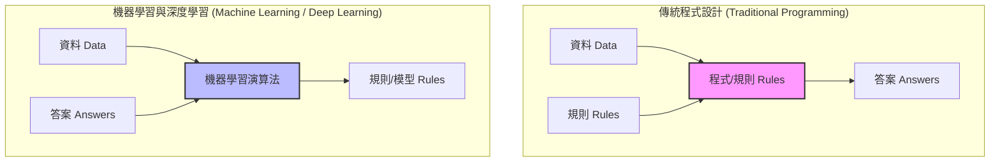

# 📈 Machine Learning & Deep Learning Practice: 從線性回歸到深度學習

歡迎來到本機器學習與深度學習實作專案！本倉庫（Repository）記錄了我們在 AI 領域的學習歷程，從最基礎的單變數線性回歸出發，演進至多元線性回歸、非線性隨機森林，並最終邁入使用 PyTorch 建構的多層感知器（MLP）神經網路。

---

## 1. 📌 專案概述 (Project Overview)

本專案是一個**動手實作的學習計畫**，旨在探索如何利用不同的機器學習與深度學習演算法來解決預測問題（以加州房價預測為主）。本專案涵蓋了以下四個重要演進階段：

1. **單變數線性回歸 (Simple Linear Regression)**：利用最簡單的單一特徵（房屋坪數）預測房價，理解機器學習的基本預測邏輯。
2. **多元線性回歸 (Multivariate Linear Regression)**：引入加州房價真實數據集，處理 8 個輸入特徵並進行特徵標準化。
3. **隨機森林回歸 (Random Forest Regressor)**：引入決策樹整合模型，捕捉資料中的非線性關係，大幅提升預測精準度。
4. **PyTorch 深度學習 (Deep Learning MLP)**：使用 PyTorch 架構建構多層感知器神經網路（Multi-Layer Perceptron），透過反向傳播演算法自主學習複雜的特徵表徵。

---

## 2. 🧠 核心機器學習與深度學習概念 (Core Concepts)

### 🔄 機器學習 vs. 傳統程式設計
傳統程式設計是由開發者手動輸入「資料」與「規則」來讓電腦產出「答案」；而機器學習（與深度學習）則是將「資料」與「答案」輸入給演算法，讓電腦自主學習並產出「規則/模型」。

$$\text{資料 (Data)} + \text{答案 (Answers)} \longrightarrow \text{規則/模型 (Rules)}$$



### 🎯 機器學習三大核心步驟
無論是簡單的線性回歸還是深層的神經網路，其訓練過程均包含以下三個核心步驟：

1. **假設模型建立 (Hypothesis Model Formulation)**
   定義輸入特徵與預測值之間的數學模型。例如單變數線性回歸：
   $$y = w \cdot x + b$$
   其中 $w$ 為權重 (Weight)，$b$ 為偏差 (Bias)。
   
2. **損失函數 (Loss Function)**
   衡量模型預測值與真實值之間的差距。本專案使用**均方誤差 (Mean Squared Error, MSE)**：
   $$\text{MSE} = \frac{1}{n} \sum_{i=1}^{n} (y_i - \hat{y}_i)^2$$
   其中 $y_i$ 為真實值，$\hat{y}_i$ 為模型預測值。
   
3. **參數最佳化 (Parameter Optimization)**
   使用**梯度下降法 (Gradient Descent)** 來調整模型參數，沿著損失函數梯度的反方向逐步更新參數以最小化誤差：
   $$w \leftarrow w - \eta \frac{\partial \text{Loss}}{\partial w}, \quad b \leftarrow b - \eta \frac{\partial \text{Loss}}{\partial b}$$
   其中 $\eta$ 為學習率 (Learning Rate)。

---

### 🌐 深度學習與神經網路核心要素
當我們邁向深度學習（Stage 4）時，核心架構擴展為：

* **多層架構 (Neural Network Architecture)**：
  包含**輸入層**（接收 8 個特徵）、**隱藏層**（進行特徵提取與轉換）與**輸出層**（產生預測房價）。
* **激活函數 (Activation Functions)**：
  神經網路在層與層之間使用非線性激活函數（如 `ReLU`：$f(x) = \max(0, x)$）。如果沒有非線性激活函數，無論疊加多少層神經網路，其本質上都只是一個大型線性組合（無法擬合非線性的多維曲面）。`ReLU` 能為網路注入非線性擬合能力。
* **反向傳播 (Backpropagation)**：
  在「前向傳播」計算出預測值與 Loss 後，透過連鎖法則（Chain Rule）將誤差由輸出層往回傳遞，計算每個權重的偏導數（梯度），並透過優化器（如 Adam）來調整所有層的神經元權重。

---

## 3. 🛠️ 開發環境與安裝設定 (Environment & Setup)

### 💻 環境初始化
本專案使用 Python 虛擬環境確保套件依賴的隔離與整潔。

1. **建立並啟用虛擬環境**：
   - **Windows (PowerShell)**:
     ```powershell
     python -m venv .venv
     .venv\Scripts\Activate.ps1
     ```
   - **macOS / Linux**:
     ```bash
     python -m venv .venv
     source .venv/bin/activate
     ```

> [!IMPORTANT]
> **Windows PowerShell 執行原則修正：**
> 若在 Windows 啟用虛擬環境時遇到「因為此系統上已停用指令碼執行，所以無法載入...」的錯誤，請在 PowerShell 視窗中執行以下指令以解除限制：
> ```powershell
> Set-ExecutionPolicy -ExecutionPolicy RemoteSigned -Scope Process
> ```

2. **安裝所需套件**：
   ```bash
   pip install scikit-learn numpy torch
   ```

---

## 4. 📈 實作演進歷程 (Evolution of Implementation)

### 📍 階段一：單變數線性回歸
* **實作程式**：[main.py](file:///c:/Users/program%20file/MachineLearning_practice/main.py)
* **應用情境**：單一變數房價預測（坪數 $\rightarrow$ 房價）。
* **核心程式碼**：
  ```python
  x = np.array([[10], [15], [20], [25], [30], [35], [40]])
  y = np.array([300, 420, 500, 600, 710, 800, 920])

  model = LinearRegression()
  model.fit(x, y)
  ```
* **訓練結果**：學得公式為 $y \approx 20.21x + 101.79$。

---

### 📍 階段二：多元線性回歸
* **實作程式**：[Linear Regression.py](file:///c:/Users/program%20file/MachineLearning_practice/Linear%20Regression.py) *(註：在指令中亦常被稱為 advanced_main.py)*
* **數據與預處理**：使用 California Housing 數據集（20,640 筆樣本，8 個特徵）。採用 80% 訓練集與 20% 測試集拆分，並使用 `StandardScaler` 進行特徵標準化。
* **評估指標**：
  * $R^2 \approx 0.5758$
  * $\text{RMSE} \approx \$74,558$ 美元
* **效能瓶頸分析**：
  真實世界中的地理座標、房屋年齡與價格並非簡單的線性正反比關係（例如特定高價地段或精華學區帶來的溢價）。多元線性回歸模型強迫以一個「平面」去擬合複雜的非線性數據，會產生明顯的**欠擬合 (Underfitting)** 瓶頸。

---

### 📍 階段三：隨機森林回歸 (非線性演算法升級)
* **實作程式**：[Random Forest.py](file:///c:/Users/program%20file/MachineLearning_practice/Random%20Forest.py)
* **演算法模型**：`RandomForestRegressor(n_estimators=100)`，利用 100 棵決策樹的隨機隨機整合，能自動捕捉特徵之間的非線性邊界。
* **評估指標**：
  * $R^2 \approx 0.8047$ (相較於線性模型顯著躍升！)
  * $\text{RMSE} \approx \$50,588$ 美元 (誤差大幅縮減約 $2.4$ 萬美元)
* **🔑 關鍵機制差異**：
  * **線性模型權重 (`coef_`)**：反映特徵的**方向性線性影響力**（如正負值代表增長或遞減）。
  * **樹狀模型重要性 (`feature_importances_`)**：反映該特徵在所有樹的節點劃分中，對於**降低方差/減少不純度（Impurity）的貢獻程度**。數值皆為正（加總為 100%），能找出最關鍵的決策因子，但不代表簡單的線性正反比。

---

### 📍 階段四：PyTorch 神經網路 - MLP (深度學習實作)
* **實作程式**：[dl_main.py](file:///c:/Users/program%20file/MachineLearning_practice/dl_main.py)
* **網路架構**：Multi-Layer Perceptron (MLP)
  * **輸入層 (8)** $\rightarrow$ **全連接層 (64)** + **ReLU** $\rightarrow$ **全連接層 (32)** + **ReLU** $\rightarrow$ **輸出層 (1)**
* **優化與訓練**：選用 `Adam` 優化器（學習率 `lr=0.01`），目標為最小化 `MSELoss()`，訓練 200 個 Epochs。
* **評估指標**：
  * $R^2 \approx 0.7377$
  * $\text{RMSE} \approx \$58,631$ 美元
* **核心程式碼**：
  ```python
  class HousingMLP(nn.Module):
      def __init__(self, input_dim):
          super(HousingMLP, self).__init__()
          self.fc1 = nn.Linear(input_dim, 64)
          self.relu1 = nn.ReLU()
          self.fc2 = nn.Linear(64, 32)
          self.relu2 = nn.ReLU()
          self.fc3 = nn.Linear(32, 1)

      def forward(self, x):
          x = self.relu1(self.fc1(x))
          x = self.relu2(self.fc2(x))
          return self.fc3(x)
  ```

---

## 5. 📊 模型效能比較 (Model Performance Comparison)

| 評估指標 / 模型 | 階段一：單變數線性回歸 | 階段二：多元線性回歸 | 階段三：隨機森林回歸 | 階段四：PyTorch MLP (深度學習) |
| :--- | :--- | :--- | :--- | :--- |
| **輸入特徵數** | 單一特徵 (坪數) | 8 個特徵 | 8 個特徵 | 8 個特徵 |
| **模型類型** | 線性模型 (Linear) | 多元線性模型 (Linear) | 決策樹集成 (Non-linear) | 多層神經網路 (Non-linear) |
| **$R^2$ Score** | 基準點 (Baseline) | $\approx 0.5758$ | **$\approx 0.8047$ (🏆 最佳)** | $\approx 0.7377$ |
| **RMSE 預測誤差** | N/A | $\approx \$74,558$ 美元 | **$\approx \$50,588$ 美元 (📉 最低)** | $\approx \$58,631$ 美元 |
| **預測核心機制** | 斜率 ($w$) | 線性係數 (`coef_`) | 特徵重要性 (`feature_importances_`) | 激活函數 (`ReLU`) 與反向傳播 |

---

## 6. 🔑 核心啟示與特徵洞察 (Key Insights & Takeaways)

### 📍 地段與收入的決定性地位
在隨機森林與多元回歸的特徵分析中，**中位數收入 (`MedInc`)** 以及**地理座標 (`Latitude` / `Longitude`)** 貢獻了超過 **70%** 的預測權重。
這充分驗證了不動產估價的經典法則：**「地段、地段、還是地段！ (Location, Location, Location!)」**。神經網路與隨機森林之所以能超越線性回歸，正是因為它們能夠將經緯度進行網格化或非線性轉換，從而學習出特定坐標區間（如舊金山灣區或洛杉磯海濱）的高溢價效應。

### 📍 表格型數據 (Tabular Data) 與深度學習的博弈
在本次實作中，我們觀察到一個有趣的現象：**隨機森林（$R^2 \approx 0.80$）的表現優於 PyTorch MLP（$R^2 \approx 0.74$）**。
這揭示了機器學習在工業界的一項重要共識：
* **表格型數據 (Tabular Data / Structured Data)**：
  以表格形式呈現的特徵資料，樹狀整合模型（如隨機森林、XGBoost、LightGBM）通常在未經複雜調參的情況下就能取得極佳的效果。它們對特徵尺度的敏感度較低、不容易過擬合，且能輕鬆切分出清晰的非線性特徵邊界。
* **非結構化數據 (Unstructured Data)**：
  神經網路與深度學習最強大的地方，在於處理影像（CNN）、文字/自然語言（Transformer/RNN）、以及語音等非結構化數據。在這些領域中，深度學習能透過表徵學習（Representation Learning）自動從原始像素或詞彙中提取高階語意特徵，這是樹狀模型所無法企及的。

---
